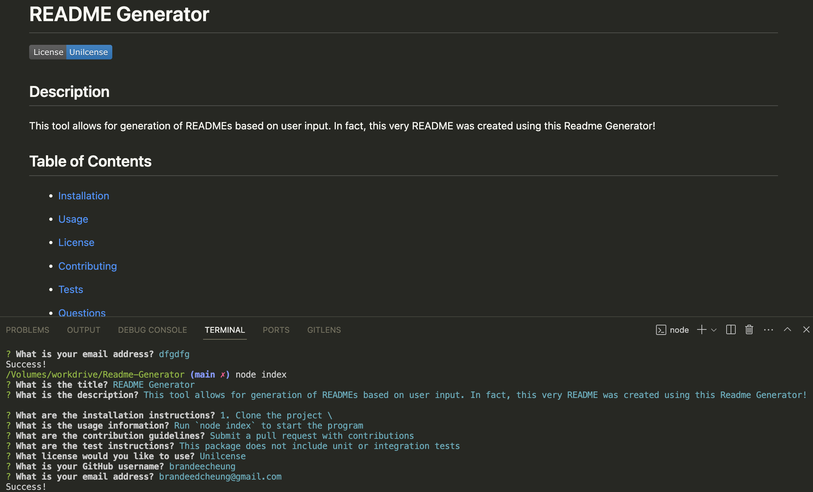

# README Generator

## Description

This tool allows for generation of READMEs based on user input. In fact, this very README was created using this Readme Generator!

## Table of Contents

* [Installation](#installation)
* [Usage](#usage)

* [License](#license)
* [Contributing](#contributing)
* [Tests](#tests)
* [Questions](#questions)

## Installation

1. Clone the project
2. Run `npm install`

## Usage

Run `node index` to start the program

## License

This project is licensed under the Unilcense license.

## Contributing

Submit a pull request with contributions to the project.

## Tests

This package does not include unit or integration tests.

## Questions

If you have any questions about the repo, open an issue or contact me directly at brandeedcheung@gmail.com. You can find more of my work at [brandeecheung](https://github.com/brandeecheung).
